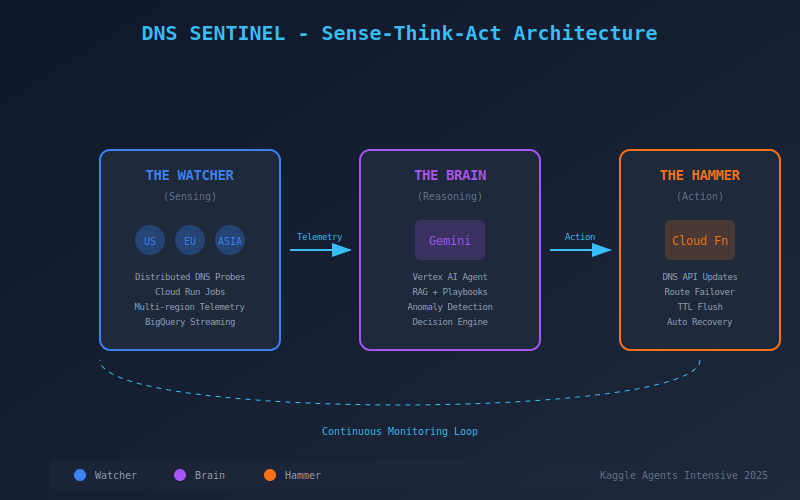

# 🛡️ Project Sentinel: Autonomous DNS Defense Agent

> **Kaggle Agents Intensive 2025 Capstone Project**
> *An AI Agent that detects internet outages and repairs infrastructure without human intervention.*

[](LICENSE)
[]()
[](https://github.com/ncode3/sentinel-dns/actions/workflows/ci.yml)

## 📺 Demo & Presentation
* **Live Demo:** `TODO: Add Cloud Run URL when deployed`
* **Video Walkthrough:** `TODO: Add YouTube video link`
* **Slide Deck:** [Google Slides Presentation](https://docs.google.com/presentation/d/1Sgn9P_J6Y_C9a-OFYzzjhzyFTRYH9QluSJLvw-bwwv8/edit?usp=sharing)

---

## 🧐 The Problem
When a major DNS provider (like Route53 or Cloudflare) fails, the "Human Lag"—the time between the alert firing and an engineer waking up to fix it, costs millions. 

**Project Sentinel** eliminates this lag. It is an **Autonomous Site Reliability Engineer (SRE)** that lives outside the blast radius, monitoring the internet's "ground truth" and executing repairs automatically.

## 🏗️ Architecture




The system operates on a **Sense-Think-Act** loop:

1.  **The Watcher (Sensing):** A distributed fleet of Python probes running in `us-central1`, `europe-west1`, and `asia-east1`. They act as the "eyes," bypassing local ISP caches to measure authoritative DNS health.
2.  **The Brain (Reasoning):** A **Vertex AI (Gemini 1.5 Pro)** agent. It ingests a sliding window of telemetry from BigQuery and uses **RAG (Retrieval Augmented Generation)** to consult "Outage Playbooks" before making a decision.
3.  **The Hammer (Action):** A privileged Cloud Function that executes the "DNS Surgery" updating the authoritative nameservers via API to reroute global traffic.

---

## 📊 Results & Metrics

| Metric | Target | Current |
|--------|--------|---------|
| Mean Time to Recovery (MTTR) | < 30 seconds | `TODO: Measure in production` |
| Detection Accuracy | > 99% | `TODO: Validate with real data` |
| False Positive Rate | < 1% | `TODO: Measure in production` |
| Autonomous Resolution Rate | > 90% | `TODO: Track in production` |

---

## 🔬 Technical Deep Dive

### RAG Implementation
The Brain component uses Retrieval Augmented Generation to enhance decision-making:
- **Knowledge Base**: Outage playbooks and historical incident data stored in a vector database
- **Retrieval**: When an anomaly is detected, relevant playbooks are retrieved based on semantic similarity
- **Augmentation**: Retrieved context is injected into the prompt to provide domain-specific guidance
- **Generation**: Gemini 1.5 Pro generates actionable decisions based on current metrics + historical knowledge

### Prompt Engineering Approach
Our prompts are designed with the following principles:
1. **Structured Output**: JSON schema enforcement ensures reliable parsing
2. **Clear Thresholds**: Numeric boundaries prevent hallucination in critical decisions
3. **Chain of Thought**: The model explains reasoning before recommending actions
4. **Conservative Defaults**: When uncertain, the system defaults to human escalation

### Key Design Decisions
- **Multi-region probing**: Eliminates single-point-of-failure in detection
- **Low-temperature inference**: Deterministic responses for infrastructure decisions
- **Graceful degradation**: Falls back to local heuristics if AI is unavailable

---

## 🚀 Quick Start (Simulation Mode)

We have included a generic simulation mode so you can test the Agent's logic without needing a Google Cloud account.

### Prerequisites
* Node.js 18+ (for the Dashboard)
* Python 3.10+ (for the Agent)

### 1. Clone the Repository
```bash
git clone https://github.com/ncode3/sentinel-dns.git
cd sentinel-dns
```

### 2. Install Dependencies
```bash
npm install
```

### 3. Run the Dashboard
```bash
npm run dev
```

### 4. Open in Browser
Navigate to `http://localhost:3000` and click **START AGENT** to begin the simulation.

### 5. Inject Chaos
Click **INJECT FAILURE** to simulate a DNS provider outage and watch the AI agent detect and remediate automatically.

---

## 💡 Lessons Learned

### What Worked Well
- **Structured Output**: Using JSON schema enforcement with Gemini eliminated parsing errors
- **Multi-region design**: Having probes in multiple regions provided ground truth verification
- **Graceful degradation**: The local heuristic fallback ensures the system works without API keys

### Challenges Faced
- **Latency simulation**: Balancing realistic latency values while keeping the demo engaging
- **Rate limiting**: Managing API calls during rapid simulation ticks required careful throttling
- **State management**: Coordinating state between refs and React state for the simulation loop

### Key Takeaways
1. Autonomous systems need multiple layers of verification before taking action
2. AI-driven infrastructure requires conservative defaults and human escalation paths
3. Demo-ability is crucial for showcasing AI agents—invest in good visualization

---

## 🗺️ Future Roadmap

### Phase 1: Enhanced Detection (Q1 2025)
- [ ] Integrate with real DNS providers (Cloudflare, Route53, Google Cloud DNS)
- [ ] Add support for more probe regions
- [ ] Implement persistent telemetry storage in BigQuery

### Phase 2: Advanced AI Features (Q2 2025)
- [ ] Train custom model on historical outage data
- [ ] Implement multi-agent collaboration (separate agents for detection, decision, action)
- [ ] Add predictive outage detection using time-series forecasting

### Phase 3: Production Readiness (Q3 2025)
- [ ] SOC 2 compliance audit
- [ ] Integration with PagerDuty/Opsgenie for human escalation
- [ ] Multi-tenant SaaS deployment

---

## 🤝 How to Contribute

We welcome contributions from the community! Here's how you can help:

### Getting Started
1. Fork the repository
2. Create a feature branch (`git checkout -b feature/amazing-feature`)
3. Make your changes
4. Run tests (`npm test`)
5. Commit your changes (`git commit -m 'Add amazing feature'`)
6. Push to the branch (`git push origin feature/amazing-feature`)
7. Open a Pull Request

### Areas We Need Help
- **Testing**: More unit and integration tests
- **Documentation**: API documentation, architecture diagrams
- **Features**: See our [Issues](https://github.com/ncode3/sentinel-dns/issues) for open feature requests
- **Bug Reports**: Found a bug? Open an issue!

### Code Style
- Use TypeScript for all new code
- Follow the existing code style (Prettier/ESLint)
- Add JSDoc comments for public functions
- Write tests for new features

See [CONTRIBUTING.md](docs/CONTRIBUTING.md) for detailed guidelines.

---

## 🙏 Acknowledgments

### Kaggle & Google
- **Kaggle Agents Intensive 2025** - For organizing this amazing capstone program
- **Google Cloud** - For providing Vertex AI and infrastructure credits
- **Gemini Team** - For building the AI model that powers The Brain

### Mentors & Community
- The Kaggle community for feedback and encouragement
- Open source contributors whose libraries made this possible

### Key Technologies
- [React](https://react.dev/) - UI framework
- [Vite](https://vitejs.dev/) - Build tool
- [Recharts](https://recharts.org/) - Charting library
- [D3.js](https://d3js.org/) - Network visualization
- [Vertex AI](https://cloud.google.com/vertex-ai) - AI platform
- [Gemini](https://deepmind.google/technologies/gemini/) - Large language model

---

## 📄 License

This project is licensed under the Apache License 2.0 - see the [LICENSE](LICENSE) file for details.

---

<p align="center">
  <b>Built with 🤖 for the Kaggle Agents Intensive 2025</b>
</p>
